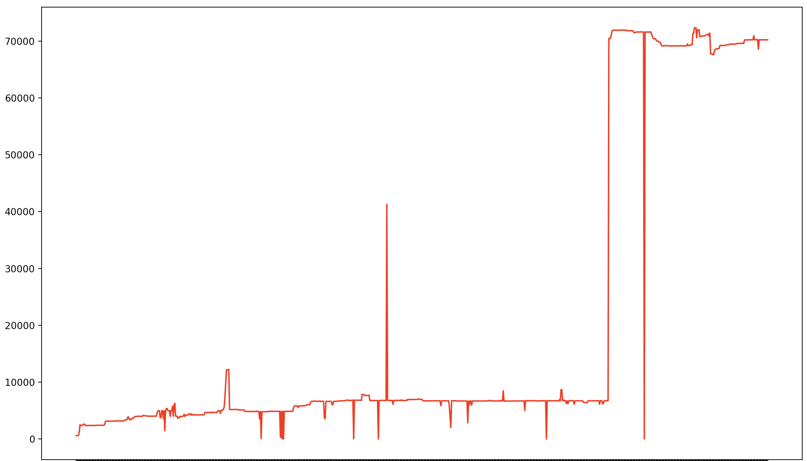
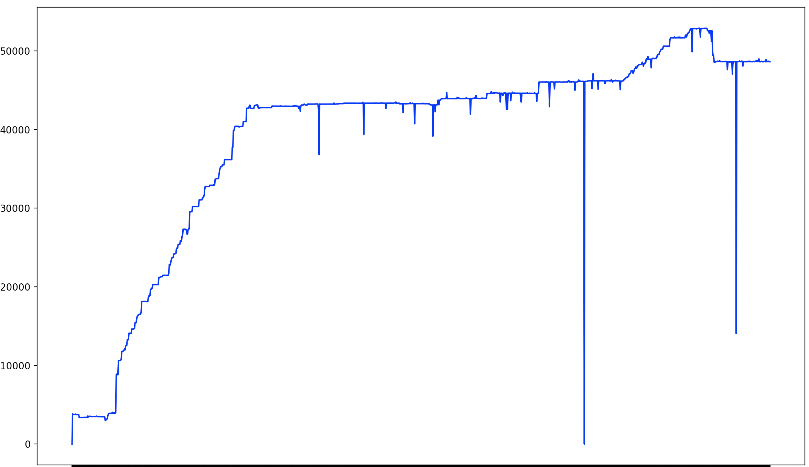
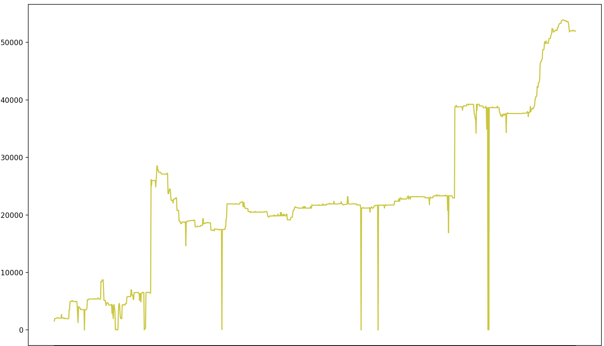

.. _examples:

Examples
========

As a toy example we want to extract and analyse the development of the size of the content about `Vikings <http://da.wikipedia.org/wiki/Vikinger>`_ in Danish.  

To do this, we extract the revision history from the page using our `Wikipedia API wrapper <https://github.com/ajoer/Wikipedia>`_, parse the output using the `WikiRevParser <https://github.com/ajoer/Wik>`_ and visualize the data. 

Extract the data
****************

The data is extracted per language and title page, so we make a parser instance for each extraction. 

	>>> from wikirevparser import wikirevparser
	>>> parser_instance = wikirevparser.ProcessRevisions("da", "Vikinger") 
	>>> parser_instance.wikipedia_page()

Parse the data
**************

Now we have the revision histories for the three language version pages, and we can parse the revision for each timestamp with just one line:

	>>> data = parser_instance.parse_revisions()

Work with the data
******************

With the revision history parsed, we can start analysing and visualizing the development of the page. 

For this example, we'll look at how the size of the content develops over time.

	>>> content_lengths = []
	>>> for timestamp in data:
	... 	content_length = len(data[timestamp]["content"])
	... 	content_lengths.append(content_length)
	>>> print(content_lengths)
	[70200, 70201, 70201, ...]

If you run the commands above, you'll notice that the size is actually decreasing. That is because the revision history is extracted *backwards in time*, so the latest revision will be the first (index [0]) in the ordered dictionary and the first revision will be the last (index [-1]).

Visualize the data
******************

Visualizing the data is easy with the timestamps and the values. 
We need the timestamps of the revisions and Matplotlib.

	>>> import matplotlib.pyplot as plt
	>>> timestamps = list(data.keys())
	>>> fig, ax = plt.subplots()
	>>> ax.plot(timestamps.reverse(), content_lengths.reverse(), color="r")
	>>> plt.show()

We use .reverse() to get a logical graph with the first revision to the left and the latest revision to the right.

Here's the development of the content size of the `Danish page <http://da.wikipedia.org/wiki/Vikinger>`_ about the Vikings from the initial page creation to March 26 2020! 

And you can do the same for the `Norwegian page <http://nb.wikipedia.org/wiki/Viking>`_ and the `Swedish one <http://sv.wikipedia.org/wiki/Viking>`_ and compare the differences:

Above is Norwegian and below is Sweden.

Try it out on a few page and languages of your own. 
You could look at football clubs, foods, celebrities, museums, or army divisions. Anything that has a Wikipedia page! 

Let us know how you're using it, and if you run into issues, check out the `FAQ or file a bug <https://github.com/ajoer/WikiRevParser/issues>`_!

